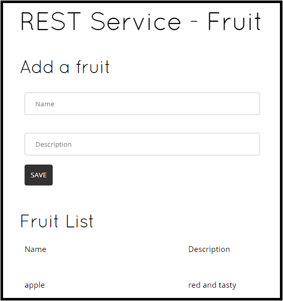
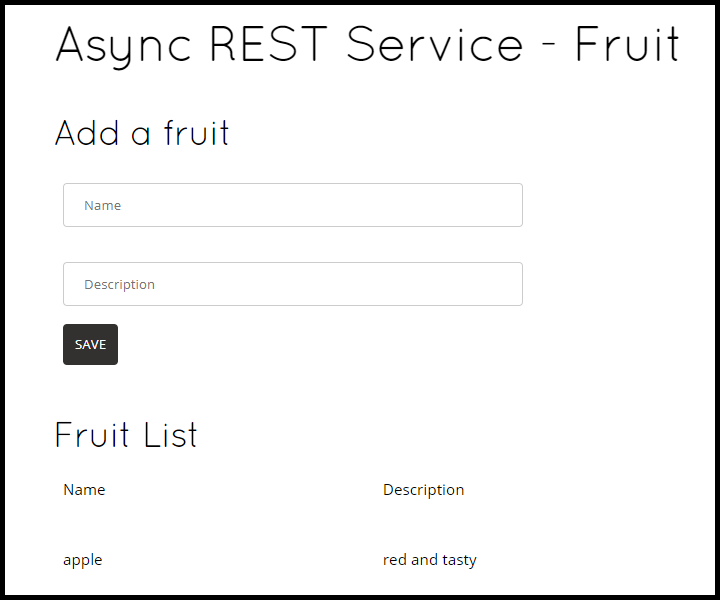
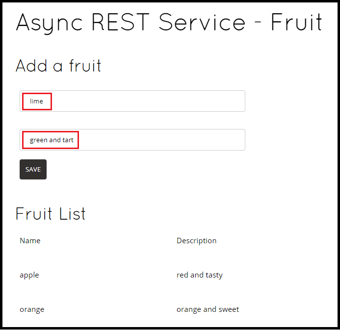

# Cassandra Client with Quarkus

Apache Cassandra® is a free and open-source, distributed, wide column store, NoSQL database management system designed to handle large amounts of data across many commodity servers, providing high availability with no single point of failure.

In this guide, we'll demonstrate how you can create a REST service to access a Cassandra database and then create a native image executable of the application.

### Credits
This example is based on an article that appears [here](https://quarkus.io/version/1.7/guides/cassandra).


### Connecting to Apache Cassandra

To connect to the Cassandra database, there are three primary properties to configure: 
* `contact-points` to access the Cassandra database
* `local-datacenter` which is required by the driver
* Optionally, the `keyspace` to bind

A sample configuration (in **src/main/resources/application.properties**) should follow this format:

```
quarkus.cassandra.contact-points={cassandra_ip}:9042
quarkus.cassandra.local-datacenter={dc_name}
quarkus.cassandra.keyspace={keyspace}
```

**NOTE:** To configure the IP for Linux on WSL2, identify the IP by executing the following command:

```
$ ping $(hostname).local
PING sws-ryzen (172.30.112.1) 56(84) bytes of data.
```

In this example, we are using a single instance running on localhost *(IP address from above)*, and the keyspace containing our data is k1:

```
quarkus.cassandra.contact-points=172.30.112.1:9042 
quarkus.cassandra.local-datacenter=datacenter1 
quarkus.cassandra.keyspace=k1
```

### Running the Cassandra Database
For simplicity, we'll use a container to run the Cassandra database.  To start the Cassandra database container, execute:
```
$ docker run --name local-cassandra-instance -p 9042:9042 -d cassandra
```

Next you need to create the keyspace and table that will be used by the application. If you are using Docker (`podman` is good alternative), run the following commands:

```
$ docker exec -it local-cassandra-instance cqlsh -e "CREATE KEYSPACE IF NOT EXISTS k1 WITH replication = {'class':'SimpleStrategy', 'replication_factor':1}"
$ docker exec -it local-cassandra-instance cqlsh -e "CREATE TABLE IF NOT EXISTS k1.fruit(name text PRIMARY KEY, description text)"
```

You can also use the CQLSH utility to interactively interrogate your database:

```
$ docker exec -it local-cassandra-instance cqlsh
Connected to Test Cluster at 127.0.0.1:9042.
[cqlsh 5.0.1 | Cassandra 3.11.10 | CQL spec 3.4.4 | Native protocol v4]
Use HELP for help.
cqlsh> select * from k1.fruit;

 name   | description
--------+------------------
  apple |    red and tasty

(4 rows)
cqlsh> exit
```

### Building the Project
To build the project, run:
```
$ mvn clean package
```
**NOTE:** We created an `uber-jar` of the application, you can choose to create a `fast-jar` instead.

To start the `jar` application, execute:
```
$ java -jar ./target/cassandra-quarkus-quickstart-*-runner.jar
__  ____  __  _____   ___  __ ____  ______
 --/ __ \/ / / / _ | / _ \/ //_/ / / / __/
 -/ /_/ / /_/ / __ |/ , _/ ,< / /_/ /\ \
--\___\_\____/_/ |_/_/|_/_/|_|\____/___/
2021-04-09 13:31:59,913 INFO  [com.dat.oss.dri.int.cor.DefaultMavenCoordinates] (main) DataStax Java driver for Apache Cassandra(R) (com.datastax.oss:java-driver-core) version 4.10.0
2021-04-09 13:31:59,952 INFO  [com.dat.oss.qua.run.int.qua.CassandraClientRecorder] (main) Enabling Cassandra metrics using Micrometer.
2021-04-09 13:32:00,214 WARN  [io.qua.run.con.ConfigChangeRecorder] (main) Build time property cannot be changed at runtime:
 - quarkus.package.type was 'native' at build time and is now 'uber-jar'
2021-04-09 13:32:00,460 INFO  [io.quarkus] (main) cassandra-quarkus-quickstart 1.0.1 on JVM (powered by Quarkus 1.13.1.Final) started in 0.893s. Listening on: http://0.0.0.0:8080
2021-04-09 13:32:00,462 INFO  [io.quarkus] (main) Profile prod activated.
2021-04-09 13:32:00,462 INFO  [io.quarkus] (main) Installed features: [cassandra-client, cdi, micrometer, mutiny, resteasy, resteasy-jsonb, resteasy-mutiny, smallrye-context-propagation, smallrye-health]

```

Or run the application in dev mode: 
```
$ mvn clean quarkus:dev
```

### Adding Data and Accessing the UI
Add some data to the database:
```
$ http POST http://localhost:8080/fruits name="apple" description="red and tasty"
HTTP/1.1 204 No Content
```
**NOTE:** These examples use [http](https://httpie.io/) but of course, `curl` will work too.

Then check to make certain the data posted properly:
```
$ http http://localhost:8080/fruits --body
[
    {
        "description": "red and tasty",
        "name": "apple"
    }
]
```

To access the REST UI, browse to: [http://localhost:8080/fruits.html](http://localhost:8080/fruits.html)



To access the Reactive UI, browse to: 
[http://localhost:8080/reactive-fruits.html](http://localhost:8080/reactive-fruits.html)



You can also add fruit to the database via the UI:



### Application Health Check
You can access the `/q/health` endpoint of your application to retrieve information about the connection validation status:

```
$ http http://localhost:8080/q/health --body
{
    "checks": [
        {
            "data": {
                "clusterName": "Test Cluster",
                "cqlVersion": "3.4.4",
                "datacenter": "datacenter1",
                "numberOfNodes": 1,
                "releaseVersion": "3.11.10"
            },
            "name": "DataStax Apache Cassandra Driver health check",
            "status": "UP"
        }
    ],
    "status": "UP"
}
```

### Create a Native Image Executable
To build a native image, execute the following command:

```
$ mvn clean package -Dnative
```

Once the compilation has finished, you can run the native executable by executing the following command:

```
$ ./target/cassandra-quarkus-quickstart-*-runner
__  ____  __  _____   ___  __ ____  ______
 --/ __ \/ / / / _ | / _ \/ //_/ / / / __/
 -/ /_/ / /_/ / __ |/ , _/ ,< / /_/ /\ \
--\___\_\____/_/ |_/_/|_/_/|_|\____/___/
2021-04-09 13:34:09,037 INFO  [io.quarkus] (main) cassandra-quarkus-quickstart 1.0.1 native (powered by Quarkus 1.13.1.Final) started in 0.018s. Listening on: http://0.0.0.0:8080
2021-04-09 13:34:09,037 INFO  [io.quarkus] (main) Profile prod activated.
2021-04-09 13:34:09,038 INFO  [io.quarkus] (main) Installed features: [cassandra-client, cdi, micrometer, mutiny, resteasy, resteasy-jsonb, resteasy-mutiny, smallrye-context-propagation, smallrye-health]

```
Since you're undoubtedly curious, let's compare the JAR and native image file sizes:

```
$ ls -lah target/cassandra-quarkus-quickstart-1.0.1*
-rwxr-xr-x 1 sseighma sseighma  73M Apr  9 12:44 target/cassandra-quarkus-quickstart-1.0.1-runner
-rw-r--r-- 1 sseighma sseighma  35K Apr  9 12:42 target/cassandra-quarkus-quickstart-1.0.1.jar
```
Using [upx](https://upx.github.io/), you can further reduce the size of the native image executable:
```
$ upx -7 -k target/cassandra-quarkus-quickstart-1.0.1-runner
                       Ultimate Packer for eXecutables
                          Copyright (C) 1996 - 2020
UPX 3.96        Markus Oberhumer, Laszlo Molnar & John Reiser   Jan 23rd 2020

        File size         Ratio      Format      Name
   --------------------   ------   -----------   -----------
  75751464 ->  21118728   27.88%   linux/amd64   cassandra-quarkus-quickstart-1.0.1-runner

Packed 1 file.
```

Comparing once again, you can see we reduced the native image executable size from **73MB** to **21MB**.
```
$ ls -lah target/cassandra-quarkus-quickstart-1.0.1*
-rwxr-xr-x 1 sseighma sseighma  21M Apr  9 12:44 target/cassandra-quarkus-quickstart-1.0.1-runner
-rwxr-xr-x 1 sseighma sseighma  73M Apr  9 12:44 target/cassandra-quarkus-quickstart-1.0.1-runne~
-rw-r--r-- 1 sseighma sseighma  35K Apr  9 12:42 target/cassandra-quarkus-quickstart-1.0.1.jar
```


You can then browse to [http://localhost:8080/fruits.html](http://localhost:8080/fruits.html) or [http://localhost:8080/reactive-fruits.html](http://localhost:8080/reactive-fruits.html) and access the application as noted earlier.

### Creating Container Images

We'll demonstrate a few options to build container images for the application:

* Using the uber-jar 
* Using Native Image
* Using a Distroless Image

First, let's build a container using the **uber-jar** version of the application:

```
$ docker build -f src/main/docker/Dockerfile.jvm -t quarkus/cassandra-client-jvm .
```
Run the container:

```
$ docker run -i --rm -p 8080:8080 quarkus/cassandra-client-jvm
exec java -Dquarkus.http.host=0.0.0.0 -Djava.util.logging.manager=org.jboss.logmanager.LogManager -javaagent:/opt/agent-bond/agent-bond.jar=jmx_exporter{{9779:/opt/agent-bond/jmx_exporter_config.yml}} -XX:+ExitOnOutOfMemoryError -cp . -jar /deployments/app.jar
__  ____  __  _____   ___  __ ____  ______
 --/ __ \/ / / / _ | / _ \/ //_/ / / / __/
 -/ /_/ / /_/ / __ |/ , _/ ,< / /_/ /\ \
--\___\_\____/_/ |_/_/|_/_/|_|\____/___/
2021-04-09 16:29:01,847 INFO  [com.dat.oss.dri.int.cor.DefaultMavenCoordinates] (main) DataStax Java driver for Apache Cassandra(R) (com.datastax.oss:java-driver-core) version 4.10.0
2021-04-09 16:29:02,000 INFO  [com.dat.oss.qua.run.int.qua.CassandraClientRecorder] (main) Enabling Cassandra metrics using Micrometer.
2021-04-09 16:29:02,354 INFO  [io.quarkus] (main) cassandra-quarkus-quickstart 1.0.1 on JVM (powered by Quarkus 1.13.1.Final) started in 0.789s. Listening on: http://0.0.0.0:8080
2021-04-09 16:29:02,354 INFO  [io.quarkus] (main) Profile prod activated.
2021-04-09 16:29:02,355 INFO  [io.quarkus] (main) Installed features: [cassandra-client, cdi, micrometer, mutiny, resteasy, resteasy-jsonb, resteasy-mutiny, smallrye-context-propagation, smallrye-health]

```
Notice it starts in ~**800ms**.

Now let's build a container with the **native image** executable:

```
$ docker build -f src/main/docker/Dockerfile.native -t quarkus/cassandra-client-native .
```
Run the native image container:
```
$ docker run -i --rm -p 8080:8080 quarkus/cassandra-client-native
__  ____  __  _____   ___  __ ____  ______
 --/ __ \/ / / / _ | / _ \/ //_/ / / / __/
 -/ /_/ / /_/ / __ |/ , _/ ,< / /_/ /\ \
--\___\_\____/_/ |_/_/|_/_/|_|\____/___/
2021-04-09 16:31:10,907 INFO  [io.quarkus] (main) cassandra-quarkus-quickstart 1.0.1 native (powered by Quarkus 1.13.1.Final) started in 0.015s. Listening on: http://0.0.0.0:8080
2021-04-09 16:31:10,907 INFO  [io.quarkus] (main) Profile prod activated.
2021-04-09 16:31:10,907 INFO  [io.quarkus] (main) Installed features: [cassandra-client, cdi, micrometer, mutiny, resteasy, resteasy-jsonb, resteasy-mutiny, smallrye-context-propagation, smallrye-health]

```
Notice the native image version starts considerably faster at ~**15ms**.

If we use the `upx` compressed version of the native image executable, the container image is reduced in size from **179MB** to **132MB** with little impact on startup times.
```
$ docker images | grep native
quarkus/cassandra-client-native     latest    d51068444298   14 seconds ago   132MB
```


Another option to shrink your container images is to consider using a distroless image.  To build a distroless image, run:
```
$ docker build -f src/main/docker/Dockerfile.distroless -t quarkus/cassandra-client-distroless .
```

Here we compare the image size of each option:
```
$ docker images
quarkus/cassandra-client-distroless    latest      ae519318cd36   2 hours ago    96MB
quarkus/cassandra-client-native        latest      1077993b8418   2 hours ago    132MB
quarkus/cassandra-client-jvm           latest      7043af3565af   2 hours ago    222MB
```

### Summary

Accessing a Cassandra database from a client application is easy with Quarkus and the Cassandra extension, which provides configuration and native image support for the DataStax Java driver for Apache Cassandra.
